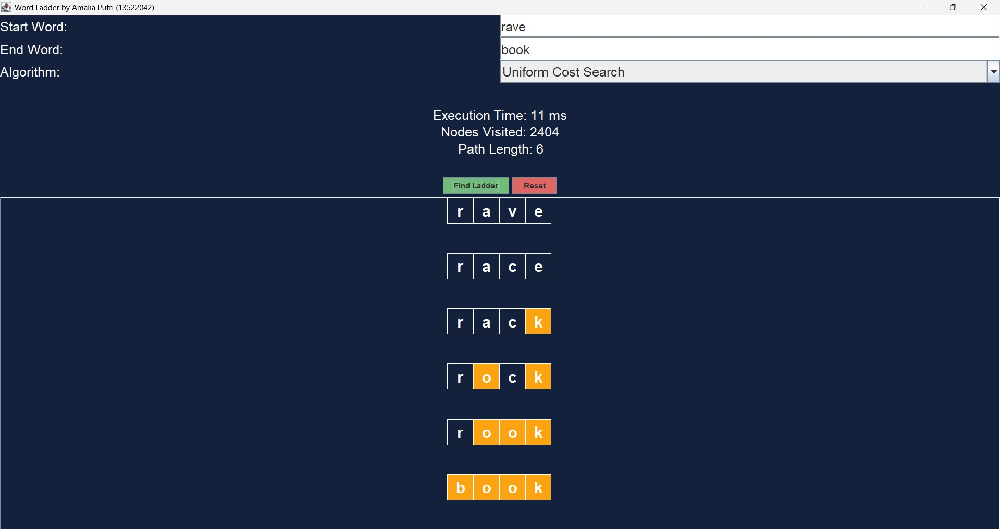
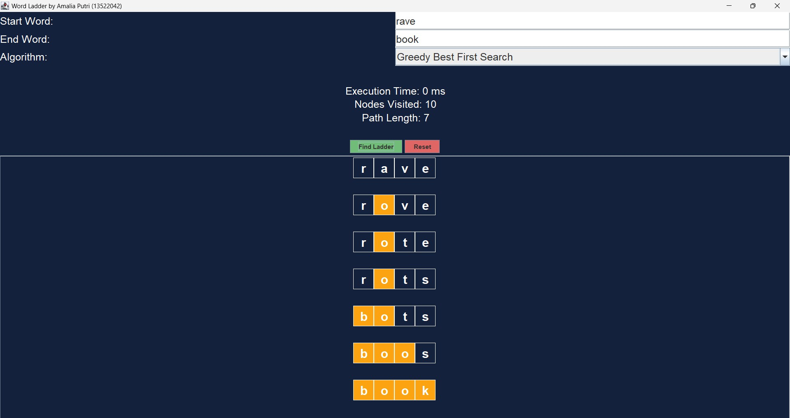
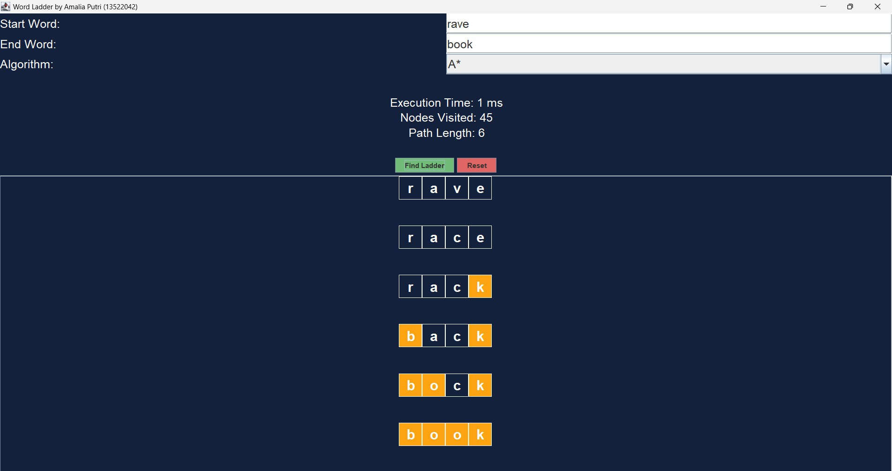

# Tucil3_13522042

Penyelesaian Permainan Word Ladder Menggunakan Algoritma UCS, Greedy Best First Search, dan A\*

## Daftar Isi

- [Informasi Umum](#informasi-umum)
- [Techstack](#techstack)
- [Features](#features)
- [Screenshots](#screenshots)
- [Setup dan Penggunaan](#setup-dan-penggunaan)
- [Penulis](#penulis)
- [Struktur Program](#struktur-program)
- [Penjelasan Struktur Program](#penjelasan-struktur-program)
- [Tambahan](#tambahan)

## Informasi Umum

Word ladder (juga dikenal sebagai Doublets, word-links, change-the-word puzzles, paragrams, laddergrams, atau word golf) adalah salah satu permainan kata yang terkenal bagi seluruh kalangan. Word ladder ditemukan oleh Lewis Carroll, seorang penulis dan matematikawan, pada tahun 1877. Pada permainan ini, pemain diberikan dua kata yang disebut sebagai start word dan end word. Untuk memenangkan permainan, pemain harus menemukan rantai kata yang dapat menghubungkan antara start word dan end word. Banyaknya huruf pada start word dan end word selalu sama. Tiap kata yang berdekatan dalam rantai kata tersebut hanya boleh berbeda satu huruf saja. Pada permainan ini, diharapkan solusi optimal, yaitu solusi yang meminimalkan banyaknya kata yang dimasukkan pada rantai kata. Berikut adalah ilustrasi serta aturan permainan.

## Techstack

Programming Language: `Java`

## Features

| **No.** |                                                               **Poin**                                                               | **Ya** | **Tidak** |
| :-----: | :----------------------------------------------------------------------------------------------------------------------------------: | :----: | --------- |
|   1.    |                                                     Program berhasil dijalankan                                                      |   ✓    |           |
|   2.    |           Program dapat menemukan rangkaian kata dari start word ke end word sesuai aturan permainan dengan algoritma UCS            |   ✓    |           |
|   3.    |                                           Solusi yang diberikan pada algoritma UCS optimal                                           |   ✓    |           |
|   4.    | Program dapat menemukan rangkaian kata dari start word ke end word sesuai aturan permainan dengan algoritma Greedy Best First Search |   ✓    |           |
|   5.    |           Program dapat menemukan rangkaian kata dari start word ke end word sesuai aturan permainan dengan algoritma A\*            |   ✓    |           |
|   6.    |                                           Solusi yang diberikan pada algoritma A\* optimal                                           |   ✓    |           |
|   7.    |                                                [Bonus]: Program memiliki tampilan GUI                                                |   ✓    |           |

## Screenshots

- Uniform Cost Search Algorithm (UCS)
  
- Greedy Best First Search (GBFS)
  
- A-Star (A*)
  

## Setup dan Penggunaan

1. Clone repositori ke lokal

   ```
   git clone https://github.com/amaliap21/Tucil3_13522042.git
   ```

2. Jalankan program

   - Windows, pada current directory `./Tucil3_13522042` jalankan file `run.bat` dengan perintah berikut:

   ```
   ./run.bat
   ```

   - Linux, pada current directory `./Tucil3_13522042` jalankan file `run.sh` dengan perintah berikut:

   ```
   ./run.sh
   ```

   `ATAU`

   ```
   make all
   ```

## Penulis

| **NIM**  |   **Nama**   |
| :------: | :----------: |
| 13522042 | Amalia Putri |

## Struktur Program

```
.
└── Tucil3_13522042
   ├── bin
   │ ├── Algorithms
   | ├── Dictionary
   │ ├── WordLadderCLI
   │ └── WordLadderGUI
   |
   ├── doc
   │ └── Tucil3_13522042.pdf
   |
   ├── src
   │ ├── Algorithms
   | ├── Dictionary
   │ ├── WordLadderCLI
   │ └── WordLadderGUI
   |
   ├── test
   │ ├── Dictionary_Option
   | └── Test_Case
   │   ├── CLI
   |   └── GUI
   |
   └── README.md
```

## Penjelasan Struktur Program

1. `Algorithms` : berisi kelas Uniform Cost Search Algorithm (UCS), Greedy Best First Search (GBFS), dan A\*
2. `Dictionary` : berisi kelas Dictionary yang digunakan untuk mengekstrak dan memvalidasi kamus `dictionary-lengkap.txt` dengan API `https://api.dictionaryapi.dev/api/v2/entries/en/`
3. `WordLadderCLI` : Menjalankan program utama dengan Command Line Interface (CLI)
4. `WordLadderGUI` : Menjalankan program utama dengan Graphical User Interface (GUI)
5. `Test_Case` : Menguji program dengan test case yang telah disediakan, baik `Input` maupun `Output`
6. `Dictionary_Option` : Menyediakan opsi kamus yang dapat digunakan pada program
   - `dictionary.txt` : kamus rujukan yang digunakan pada program
   - `dictionary-API.txt` : kamus `dictionary-lengkap.txt` yang diekstraksi oleh API
   - `dictionary-lengkap.txt` : kamus beserta kata-kata informal
   - `dictionary-oxford.txt` : kamus oxford (kurang lengkap)

## Tambahan

`build.gradle`, `gson-2.10.1.jar`, dan `pom.xml` digunakan untuk membuat dictionary-API.txt
